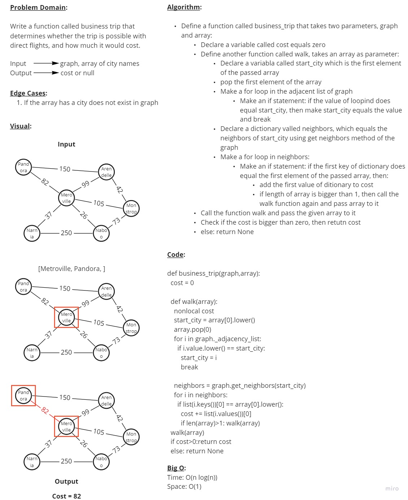
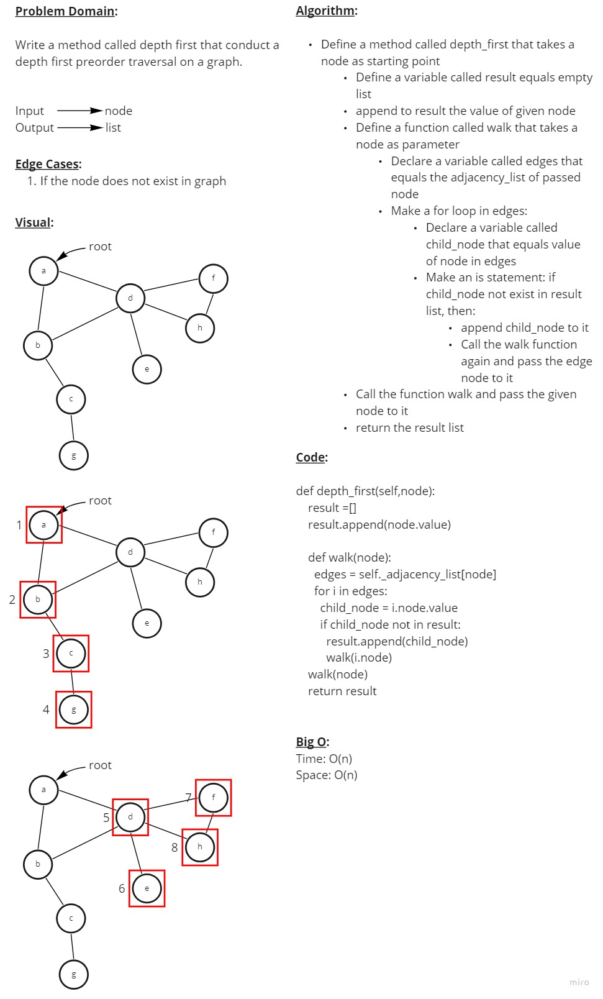

# Graphs

## Code Challenge 35

### **Feature Tasks**

Implement your own Graph. The graph should be represented as an adjacency list, and should include the following methods:

&nbsp;

- **add node**
  - Arguments: value
  - Returns: The added node
  - Add a node to the graph

&nbsp;

- **Add a node to the graph**
  - Arguments: 2 nodes to be connected by the edge, weight (optional)
  - Returns: nothing
  - Adds a new edge between two nodes in the graph
  - If specified, assign a weight to the edge
  - Both nodes should already be in the Graph

&nbsp;

- **get nodes**
  - Arguments: node
  - Returns a collection of edges connected to the given node
    - Include the weight of the connection in the returned collection

&nbsp;

- **size**
  - Arguments: none
  - Returns the total number of nodes in the graph

&nbsp;

### **PR Link**

<https://github.com/YAHIAQOUS/data-structures-and-algorithms/pull/57>

&nbsp;

## Code Challenge 37

### **Feature Tasks**

- Determine whether the trip is possible with direct flights, and how much it would cost.

  - Write a function called business trip:

    - Arguments: graph, array of city names
    - Returns: cost or null

&nbsp;

### **Whiteboard Process**

&nbsp;

### **PR Link**

<https://github.com/YAHIAQOUS/data-structures-and-algorithms/pull/59>

&nbsp;

## Code Challenge 38

### **Feature Tasks**

- Write the following method for the Graph class:

  - depth first:

    - Arguments: Node (Starting point of search)
    - Returns: A collection of nodes in their pre-order depth-first traversal order

&nbsp;

### **Whiteboard Process**

&nbsp;

### **PR Link**

<https://github.com/YAHIAQOUS/data-structures-and-algorithms/pull/60>

&nbsp;
