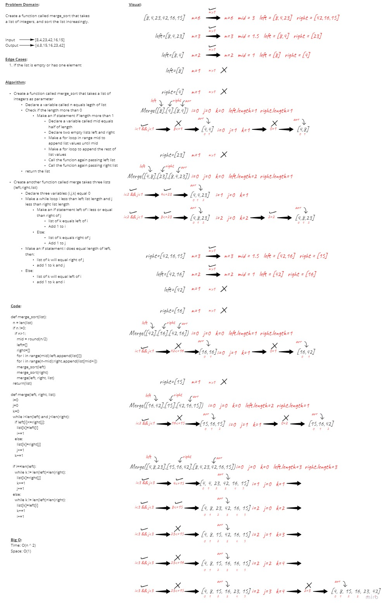

# Merge Sort

## Code Challenge 27

### **Feature Tasks**

- Review the pseudocode below, then trace the algorithm by stepping through the process with the provided sample array. Document your explanation by creating a blog article that shows the step-by-step output after each iteration through some sort of visual.

      ALGORITHM Mergesort(arr)
          DECLARE n <-- arr.length

          if n > 1
            DECLARE mid <-- n/2
            DECLARE left <-- arr[0...mid]
            DECLARE right <-- arr[mid...n]
            // sort the left side
            Mergesort(left)
            // sort the right side
            Mergesort(right)
            // merge the sorted left and right sides together
            Merge(left, right, arr)

      ALGORITHM Merge(left, right, arr)
          DECLARE i <-- 0
          DECLARE j <-- 0
          DECLARE k <-- 0

          while i < left.length && j < right.length
              if left[i] <= right[j]
                  arr[k] <-- left[i]
                  i <-- i + 1
              else
                  arr[k] <-- right[j]
                  j <-- j + 1

              k <-- k + 1

          if i = left.length
            set remaining entries in arr to remaining values in right
          else
            set remaining entries in arr to remaining values in left

- Provide a visual step through for each of the sample arrays based on the provided pseudo code

- Convert the pseudo-code into working code in your language

- Present a complete set of working tests

&nbsp;

### **Whiteboard Process**

&nbsp;

### **PR Link**

<https://github.com/YAHIAQOUS/data-structures-and-algorithms/pull/52>
